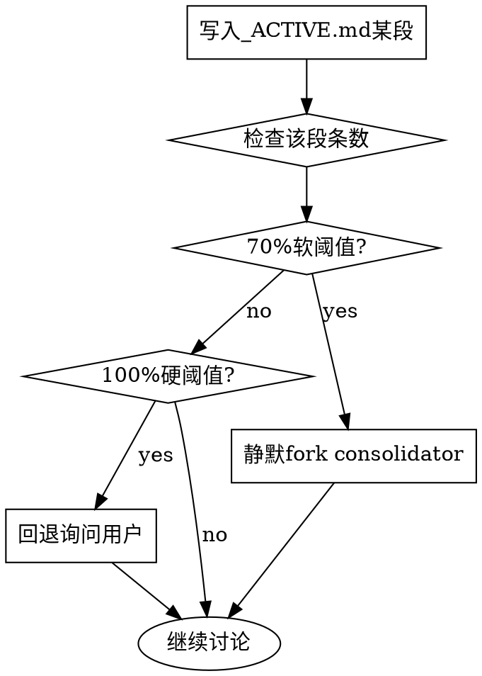

# Project Discuss

L1 协议入口：管理项目讨论、记录决策、处理查询、记录 incidents。

本 SKILL.md 是动作骨架 + Phase 化导航。L0 借口反驳 4 项（#1/#2/#4/#5）+ 单判据 happy path 已在 `cadence-bootstrap/SKILL.md` inline；细则单一权威源在 `references/`，按需读取：

- `references/recording-protocol.md` — 记 阶段细则 + 信息密度正反例 + entry schema + **incidents 附录（v0.5 合并 incident-handling.md）**
- `references/query-behavior.md` — 查询行为 + 4 trigger 主动重读 + **文档可信度 L1-L4（v0.5 合并 doc-reliability-protocol.md）**
- `references/harness-adapters.md` — **Codex `spawn_agent` + OpenCode 工具映射（v0.5 合并 codex-tools.md + opencode-tools.md）**

## § 1. 讨论开始前（必做）

### 第 1 步：检查 cadence 骨架

读 `cadence/_INDEX.md`：

- 不存在 → 告知用户："看起来这是新项目，还没初始化 cadence。我可以先跑 `/cadence-init` 建好骨架，然后继续讨论。要开始吗？"
- 存在 → 继续第 2 步

### 第 2 步：建立全局上下文

1. 读 `cadence/_INDEX.md`（纯索引，< 800 tokens）—— 项目简述 / 话题词典 / 快速导航
2. Session 内第一次需要活跃状态时，读 `cadence/_ACTIVE.md`（~1800 tokens）—— 活跃决策 / 待决 / TODO / 最近讨论
3. 用户提到的话题在词典里 → 读指向的文档；用户问历史话题（> 14 天前）→ 读 `_INDEX-HISTORY.md`
4. **不全量加载**：默认不重读，4 trigger 时重读（详 `references/query-behavior.md`）

## § 2. Phase 化协议骨架

完整细则见 `references/recording-protocol.md`。

### Phase 1 记 — 触发 / 落点 / 告知 / 铁律 / 质量自检

- **触发**：单判据「已被承接」命中 → append streaming entry
- **落点**：`cadence/streaming/<YYYY-MM-DD>-<topic-slug>.md`
- **铁律**：append-only（不修改已有 entry；撤回 = append tombstone）
- **告知**：一行 `📝 已记：<摘要> → <path>`

★ **质量自检 checklist**（扩展 L0 §5c 简版）：

写完 entry 后自检以下 6 项，任一关键缺失 → append 补充段：

  ☐ `chosen`        — 选了什么方案？（必填）
  ☐ `context`       — 决策的前提 / 场景？
  ☐ `options`       — 讨论中有过哪些候选？
  ☐ `rejected`      — 为什么不选其他？各自被排除原因？
  ☐ `dependencies`  — 是否依赖其他 entry（引用 id）？（可选）
  ☐ `status`        — accepted / pending / superseded？

minimum 充分组合：`chosen + context + (options 或 rejected)`
trap signal：单写"chosen X 已承接"必然下游失血，补充 `context` + `rejected`

完整正反例详见 `references/recording-protocol.md` § 2「信息密度正反例」。

### Phase 2 整 — 触发 / 流程

**触发**：LLM 自判（话题收尾 / context ≥80% / `_ACTIVE.md` 段达阈值 / handoff 兜底）。

**流程**：派 `recall-consolidator` subagent（Plan-only）→ 接收 yaml plan → 主 session 三步写（Write → Validate → Archive）。Validate 未通过绝不进入 Archive。

完整流程与失败降级详见 `references/recording-protocol.md` § 3。

### Phase 3 查 — 触发 / 流程 / 硬限

**触发**：用户问历史决策 / 主 session 不确定某历史是否有记录 / 4 trigger 主动重读。

**流程（强制）**：**必须** fork retriever subagent — CC 用 Task tool / Codex 用 `spawn_agent(explorer, message=<XML wrapped recall-retriever prompt>)`（详见 `references/harness-adapters.md` § 4）→ 接收 `summary` + `pointers[]`（**总 <500 tokens 硬限**）→ 主 session 呈现。

**反例（禁止）**：「刚刚没有 spawn subagent，我只是本地读了几个 cadence 文档和用 PowerShell 搜了一下」—— 协议违例。

完整触发路径与失败降级详见 `references/query-behavior.md` 查阶段节。

### recall-analyzer（决策前回忆分析）

5+ 轮 / 多档案 / 冲突风险时 fork `agents/recall-analyzer.md`，产三分类事实（你说的 / 档案有的 / 我推断的）呈现用户。主 session 写，subagent 不写。

## § 3. 主 session 工作记忆（v0.4 lifecycle）

主 session 在对话上下文中（**不落盘**）维护：

| 项 | 维护方式 | 用途 |
|---|---|---|
| `n_rounds_counter` | 每用户发言 +1 / 触发归零 / session 启动初始化 0 | 冷启动兜底 trigger（N=20 轮） |
| `recent_user_turns` | FIFO buffer 容量 10 / 摘要 ≤50 字 / 超出丢最旧 | consolidator 检测"用户言命中"（如"X 写完了"） |

**不维护**（按需 collect）：`git_log_window` — fork consolidator 前用 Bash `git log --since=30.days` 收集；Bash 不可用时传 `[]` fallback。

**重启行为**：session 重启 / context reset 时所有工作记忆归零 — ASSUME INTERRUPTION 原则。

完整 fork 输入 schema 详见 `agents/recall-consolidator.md` § 输入 schema。

## § 4. `_ACTIVE.md` 段独立管理

### 段独立触发归档（v0.4）

每次写入 `_ACTIVE.md` 某段后，**仅检查该段的条数上限**：

| 段 | 条数上限 | 满时 trigger |
|---|---|---|
| 活跃决策 | 8 | 第 9 条到来 |
| 待决 | 10 | 第 11 条到来 |
| TODO | 10 | 第 11 条到来 |
| 最近讨论 | 5 | 第 6 行到来 → 最旧移到 `_INDEX-HISTORY.md` |

**总上限 `<1800 tokens`** 仅作最终兜底。

### 软硬阈值切换（v0.4）

- **软警告（70%）**：阈值 6/8、7/10、7/10、4/5 任一段命中 → 静默 fork consolidator（`trigger_reason=section_70`）→ 自动 Edit + Write archive → 一行通知
- **100% 硬阈值**（兜底）：任一段达上限 → 主 session 回退询问用户（v0.3 行为，见「补救路径」）

> ★ **借口反驳 #3**："上限到了再问用户怎么归档" → **错** — 70% 软警告时 consolidator 已经静默处理了，不要等到 100%。

通知格式见 `agents/recall-consolidator.md` § 输出 plan 示例。

### Undo 协议

"撤回归档 D5" → 主 session 按 plan 中 `undo_hint` 反向操作；plan 丢失（重启 / reset）→ 凭 git log 找对应 archive commit 反向 Edit。详见 `agents/recall-consolidator.md` § 输出 plan 增量字段。

### 补救路径

1. 有对应 discussion 文档 → 追加"已归档决策"节
2. 无文档但关联主题明确 → 建新 discussion 文档
3. 孤立决策 → 询问用户（征询图景 ③，见 `references/recording-protocol.md`）

→ 归档完成 → 从 `_ACTIVE.md` 移除最老条 → Write 新决策 → 告知含"归档了 X → Y"。

**关键**：永远不让写入失败。所有路径失败 → 退化为"用户手动决定 + 新决策暂不写入"。

### 归档策略

- 超 14 天讨论记录 → `_INDEX-HISTORY.md`
- 超 30 天 `_INDEX-HISTORY.md` 记录 → 按月分组移到 `_archive/YYYY-MM.md`

## § 5. 记录位置分流（完整表）

| 内容类型 | 写入位置 |
|---|---|
| 决策结论 | `_ACTIVE.md` 活跃决策 |
| 硬约束 | `_INDEX.md` 项目简述（推翻时双写 `_ACTIVE.md`）|
| 待决问题 | `_ACTIVE.md` 待决清单 |
| TODO | `_ACTIVE.md` |
| 详细设计 | `cadence/discussions/<date>-<slug>.md` |
| Bug/incident | `cadence/discussions/incidents/YYYY-MM-DD-xxx.md` |
| 讨论记录 | `_ACTIVE.md` 最近讨论（14 天内）/ `_INDEX-HISTORY.md`（14-30 天）|
| 话题词典 | `_INDEX.md` |
| 流式 entry | `cadence/streaming/<date>-<slug>.md`（append-only） |

## § 6. 中途自检

Session 进行中若发现本 skill 未触发（典型信号：已在讨论 / 决策但从未加载 `_INDEX.md`、从未记录任何条目），必须：

1. 立即激活本 skill（补调 `Skill("project-discuss")`）
2. 追溯征询：列出本 session 已产生的决策点，一次性问"要全记 / 选记（指出编号）/ 都别记？"
3. 按用户选择补写，汇报时说明"追溯记录"

宁可多自检一次，不要等用户质问。

## § 7. 特殊场景处理

### 查询类

- **"我们讨论到哪了" / "目前确定了什么"** → 读 `_INDEX.md` + `_ACTIVE.md`，综合总结
- **"XX 确定了吗"** → 查活跃决策 + 历史讨论 + 代码实际状态，综合引用来源
- **用户问历史决策过程** → 走 Phase 3 retriever 路径（不能主 session 直读）

### 修改类

- **用户想修改已确定内容** → 确认意图后更新 + `_ACTIVE.md`；重大变更归档旧版到 `_archive/`
- **开发中发现设计与现实不一致** → 更新设计文档 + `_ACTIVE.md` 活跃决策记录变更原因

### 导航类

- **讨论主题不在话题词典中** → 用 Grep 搜 `cadence/` 目录找相关文档
- **用户提供新外部文档** → 整理关键内容到对应 discussion 文档

## § 8. 话题词典维护 + 路由表

每次写决策到 `_ACTIVE.md` 后，顺手更新 `_INDEX.md` 的「话题词典」：

```markdown
## 话题词典
- 数据库选型 → discussions/05-tech/database.md
```

**文档数 > 10 时启用** `cadence/discussions/_INDEX-ROUTING.md`：

| 话题 / 关键词 | 指向 |
|---|---|
| Incident / bug 记录 | `references/recording-protocol.md` § 8 |
| 文档可信度 L1-L4 | `references/query-behavior.md` § 11 |
| Harness 适配（CC / OpenCode / Codex） | `references/harness-adapters.md` |
| 信息密度正反例 / entry schema | `references/recording-protocol.md` § 2 |
| 查询前置 / 4 trigger 主动重读 | `references/query-behavior.md` |

## § 9. Session 结束提醒（克制版）

识别到明显终止信号（「今天到这」「改天」「换个项目」）时，**一次性、克制地**提醒：

```
看起来告一段落了。如果想把本 session 内容保留到档案，可以用 /cadence-handoff。
```

**同一 session 只提醒一次**。不基于长度触发。

## § 10. 段独立 trigger 决策流（LLM behavior shaping）



> Phase 选择流（用户发言 → 记/整/查）见 § 2 描述，不再图形化重复。
